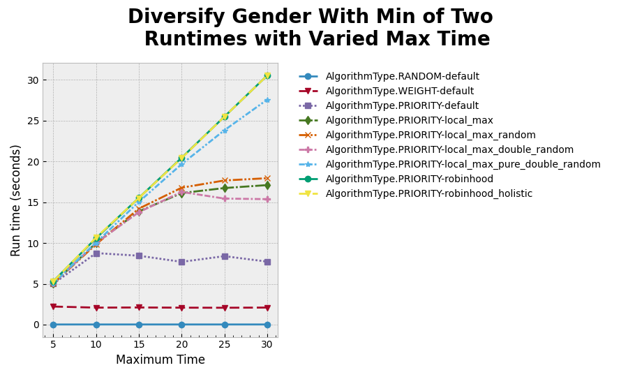

# Diversify Gender Min 2 Priority Algorithm Report

## Diversify Gender Min 2

The first set of runs was done with the following constants:

- max keep = 3
- max spread = 3
- max iterate = 300
- max time = 20
- ratio of female students = 0.4
- number of students = 200
- number of teams = 40

These constants were picked for several reasons:

1. Most of them are the baseline constants which had previously been benchmarked.
2. For the diversify gender min 2, the algorithm could place exactly two female students on each team.
3. The constants would not interfere with each other. For example, the max time can interfere with max iterate, as the

For each of the following runs, the baseline constant was used except for one variable, which was incrementally varied
across some range. The range is included with the graphs and information about the run.

In each run, the following algorithm configurations were benchmarked:

- Default Random Algorithm
- Default Weight Algorithm
- Default Priority Algorith (three random swap mutations)
- Priority Algorithm with one Local Max Mutation and two Random Swap Mutations
- Priority Algorithm with one Local Max Random Mutation and two Random Swap Mutations
- Priority Algorithm with one Local Max Double Random Mutation and two Random Swap Mutations
- Priority Algorithm with three Local Max Double Random Mutations
- Priority Algorithm with one Robinhood mutation and two Random Swap Mutations
- Priority Algorithm with one Robinhood Holistic mutation and two Random Swap Mutations

Note: the number of mutations is equal to the maximum spread variable, so these configs will change slightly when that
variable is varied.

### Class Size Run

This run varied the size of the class from 20 to 400 students in increments of 20.

- The run time for this graph look mostly consistent other than a few seemingly random spikes from the default priority
  algorithm and the local max priority configurations.
- My guess would be that for some reason, the operating system scheduled the tasks poorly, or something else related to
  it; however, this should still be investigated to double-check because with a number of trials set so high, I would
  have
  expected the line to be nearly entirely smooth.
- Also, the local max algorithms seem to level off around 20 seconds, which was the cap of the allowed time. It is
  strange that it did not exceed the cap, as the algorithm only stops running after the amount of time has been
  exceeded. It could also be that for some reason it levels off at this point, but a runtime of greater than 20 seconds
  would have to be tested to see this.
- For the spike in the double random, I think this might be one off as it is approaching the 20-second mark before the
  spike, and might just have gotten another round of the algorithm in due to the spacing
- We should probably also implement error bars, so we can have a better idea of the range of these spikes. It could just
  be that we got unlucky, and the error bar could be wide and encompass the general trend.

- the gini index was for some reason quite varied with the class size
- for all the configurations other than weight, it seemed to stay within around a 0.55 to 0.6 range, while the weight
  algorithm plateaued at about 0.47

- the priority satisfaction score was very jagged, and other than the random algorithm, seemed to follow no particular
  pattern
- I looked briefly at the output team sets, and the teams seem to be decent, but I think it could be useful to query the
  json documents with some library to get the exact number of teams that satisfy the constraint at each class size
- This would hopefully let us get a better idea if the teams were relatively consistent, and this had to do with the
  metric or scoring function, or if there is some sort of strange issue with different class sizes

- From this graph, we can se that the weight algorithm does slightly worse on average then most implementations of
  priority.
- With this and the previous graph, we can see that robinhood is offering no additional improvement over the weight
  algorithm with the current constants
- A worrying feature is that for larger class sizes, the priority algorithm seem to perform worse than the weight
  algorithm. This might be because the students generated for each algorithm are not exactly the same because of how
  the mock student generator works. It may also be that for some reason, the algorithm is deciding to not keep the
  teams output from the weight algorithm, but this would likely be a bug and should be investigated.

### Note About Subsequent Runs

- for the subsequent runs, the priority algorithm basically offered no improvement over the weight algorithm
- the weight algorithm basically achieved a near perfect score, and the priority algorithm was essentially unable to
  improve the teams in any meaningful way
- a smaller class size should be investigated, as that is where priority seems to do better, as well as a more complex
  set of goals, including project requirements and preferences
- I did complete another set of runs with a larger class size and lowering the other parameters substantially, but
  the results were similar and the priority algorithm offered minimal or no improvement over the weight algorithm.
- Also, for all subsequent graphs, the priority satisfaction scale was adjusted to zoom into the area where all the
  priority configurations and the weight algorithm results were. The random algorithm was constant with a score around
  0.6 in all the graphs.

### Max Keep Run

This run varied the maximum number of nodes to keep from the output nodes for the priority algorithm.
This was varied between 1 and 10.

### Max Spread Run

- This run varied the maximum spread between one and ten inclusive.
- The satisfied priorities were essentially constant

### Max Time Run

### Max Iterations Run

### Summary

In summary, for most of the runs other than class size, the output from the weight algorithm was nearly perfect, so only
very minimal, if any improvements could be made (on the scale of one or two teams in 50 teams, or an improvement of
0.01 to 0.02 on the satisfied priorities metric). The changing class sizes seems to lead to spikes in the graphs, and
this should be investigated to determine what the root cause is. Also, error bars should be added to the graph to give
an idea if the spikes are within the margin of error. More benchmarks should be carried out with a lower class size (
something closer to 100) to get a better idea of how priority can improve on the weight algorithm, and some scenarios
with more complex requirements to see how the weight and priority algorithm fair.
