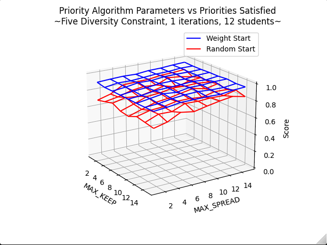
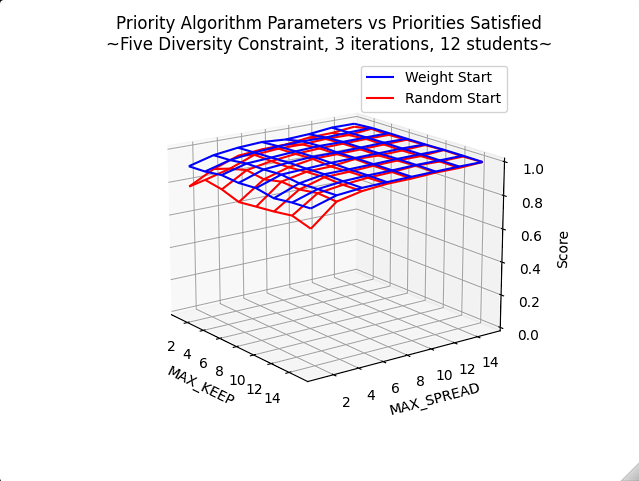
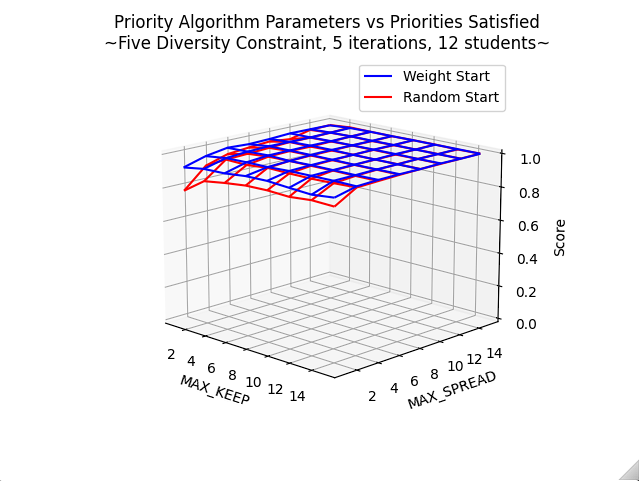
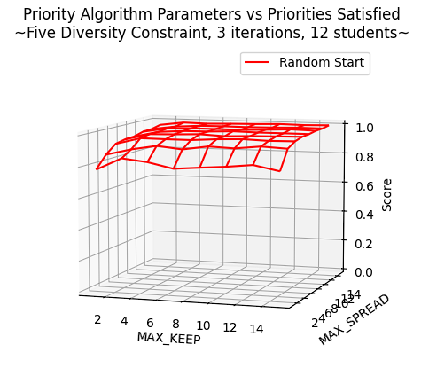
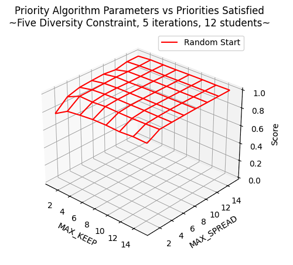
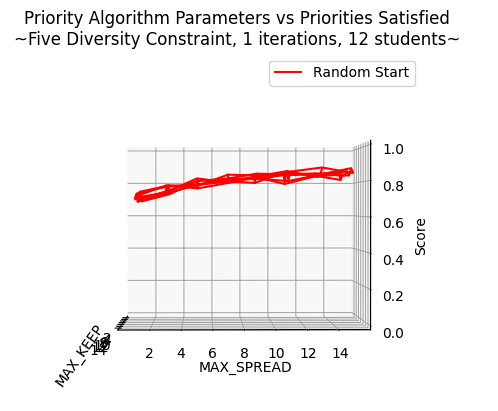
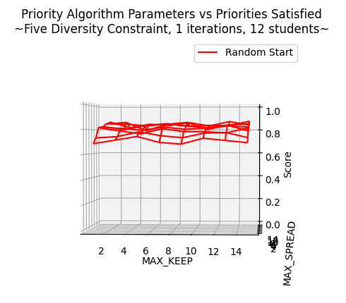
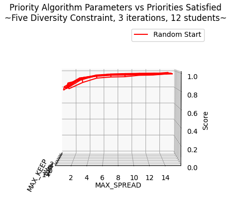
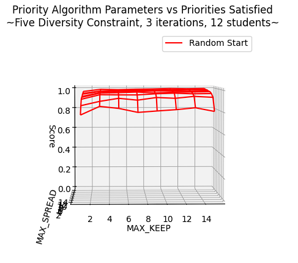

# Findings

## Five Diversity Constraints

### Scenario

Constraints:
- Diversify gender min 2
- Diversify gpa min 2
- Diversify age min 2
- Diversify major min 2
- Diversify race min 2

Students were hard coded in order to guarantee a max score of 1.0 and to ensure that the solution is not trivial.

Gender: Male, GPA: A, Age: 20, Major: CompSci, Race: European \
Gender: Female, GPA: B, Age: 20, Major: Math, Race: African \
Gender: Female GPA: B, Age: 21, Major: Math, Race: European \
Gender: Male, GPA: A, Age: 21, Major: CompSci, Race: African \
Gender: Female, GPA: A, Age: 20, Major: Math, Race: European \
Gender: Female, GPA: B, Age: 21, Major: Math, Race: European \
Gender: Male, GPA: B, Age: 21, Major: CompSci, Race: African \
Gender: Male, GPA: A, Age: 20, Major: CompSci, Race: African \
Gender: Male, GPA: B, Age: 20, Major: Math, Race: European \
Gender: Female, GPA: B, Age: 21, Major: CompSci, Race: African \
Gender: Male, GPA: A, Age: 20, Major: Math, Race: African \
Gender: Female, GPA: A, Age: 21, Major: CompSci, Race: European

### Findings

Below we see the results of this run:

 

We see that the weight start helps a lot, so it's going to be better to look at the random start in order to see how well the priority algorithm does by itself.

Even with only 3 iterations, priority is able to pretty much solve the scenario

And with 5 iterations, it has the max score with all but the worst settings:

**The most interesting results are with only 1 iteration.**

We see a clear correlation between higher `MAX_SPREAD` and a higher score, but the same is not true of `MAX_KEEP`

We see the same thing in the 3 iteration graph:

