# Analysis of Social Algorithm Benchmarks 📈

## Varying Class Size

The first run varied just the class size to see if there are any effects of increasing the class size.

### Scenario

The scenario being run here is that students are in perfect cliques of 5 students with 2 enemies each.

### Findings

The first observation I made was that it seems like a near trivial task to satisfy a student's enemy preferences with a
sufficiently large ratio of class size to team size. If we look at the strictest measure of social
satisfaction, [strictly happy team](#metrics), we see that even the random algorithm can satisfy nearly all enemy
preferences.

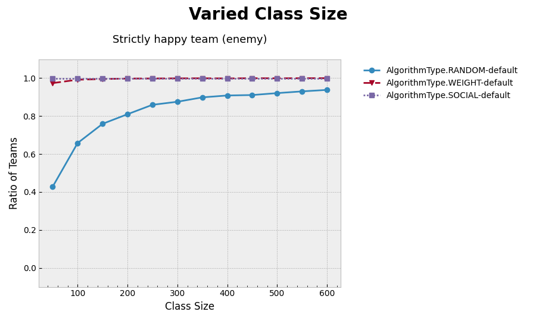

This is a pattern we can look at further when looking at the [varied number of enemies](#varying-number-of-enemies) run.

This pattern is clearly not reflected by friend preferences. With the same metric, the story is clear:

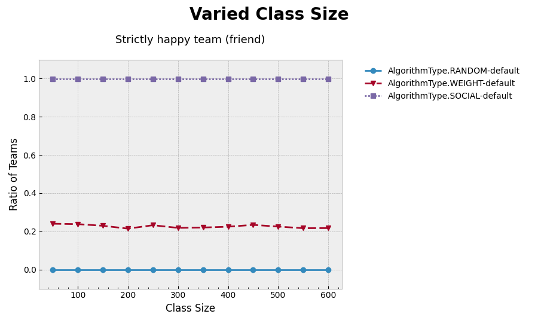

If we use a slightly less strict metric, teams with at least one [happy person](#metrics), we see a bit more clearly the
performance of the random and weight algorithms:

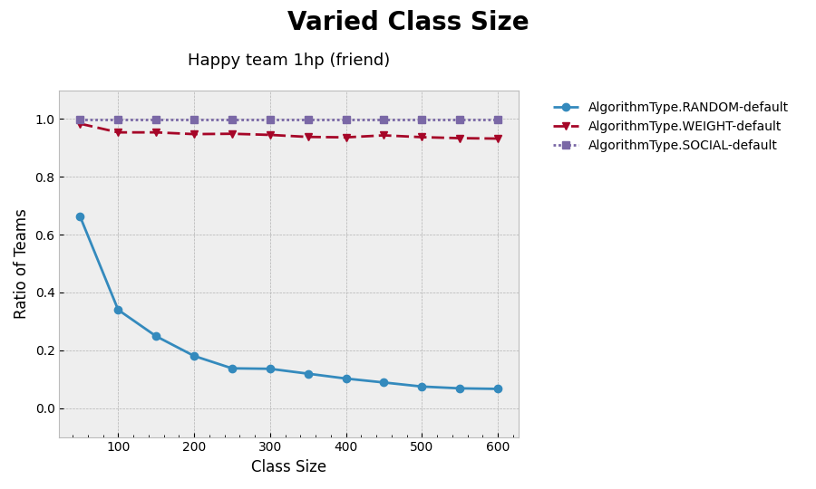

Clearly other algorithms than the social algorithm struggle to satisfy this constraint, but the takeaway here is that
the social algorithm is able to perfectly satisfy the friend preferences, even as the class size becomes very large.

The runtimes are also kept under control as the class size grows, beating the weight algorithm in this scenario.

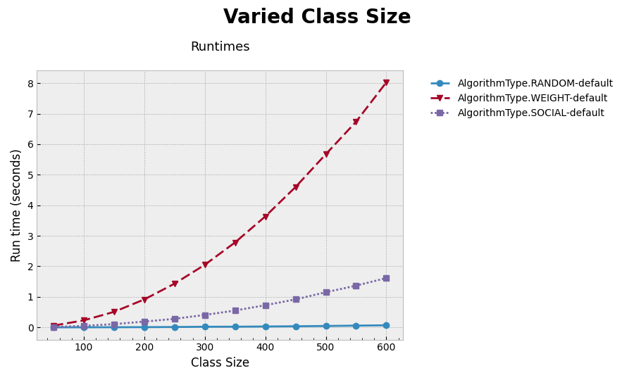

## Varying Number of Friends

To measure the effects of varying the number of friends students are allowed to choose, we will look at only the
interesting ratios of clique size to team size.

### Scenario

For this scenario, the team size is held constant at 4. Then the clique size was varied by giving students different
numbers of friends. The clique sizes studied were 2, 4, 6, and 8 to examine the behaviour of the social algorithm when
cliques are ½, 1, 1½, and 2 times the size of the team, respectively.

### Findings

The most interesting finding is that the social algorithm is unable to handle the case when cliques are half the size of
the team. In this case, we would expect to see that two cliques are placed into each team, but instead we see that only
one is placed in, then the rest of the team is not filled by the social algorithm, but presumably by the weight
algorithm.

This is demonstrated by first looking at the graph of teams with at least one [strictly happy person](#metrics) in terms
of friends, then at the graph of strictly happy teams.

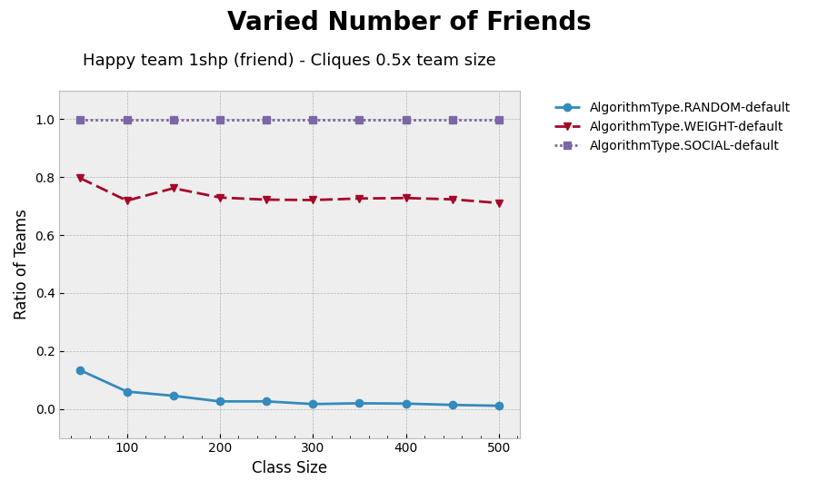

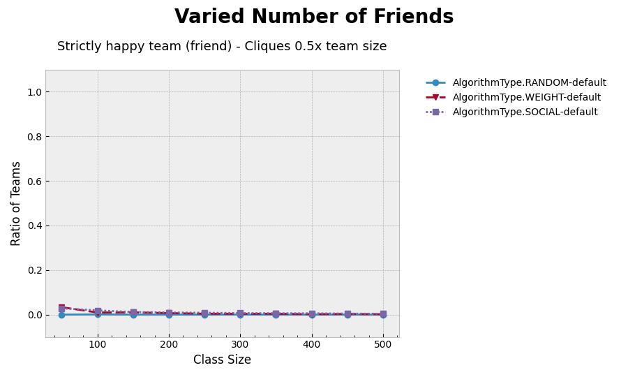

Clearly there are students in the team that have all of their friends, but this is not true for everyone in the team. If
there were two cliques in a team, we would expect the second graph to look the same as the first. If we look at one of
the teams created by the social algorithm, we get a better idea of what's happening:

<table>
  <tr><th>Student id</th><th>Friend</th></tr>
  <tr><td>12</td><td>13</td></tr>
  <tr><td>13</td><td>12</td></tr>
  <tr><td>15</td><td>14</td></tr>
  <tr><td>33</td><td>32</td></tr>
</table>

We see that students 12 and 13 are a clique, so they're satisfied, but then 15 is in a clique with 14, but the other
student in the team is 33.

The other abnormality we see is some fluctuating runtimes as we change the class size:

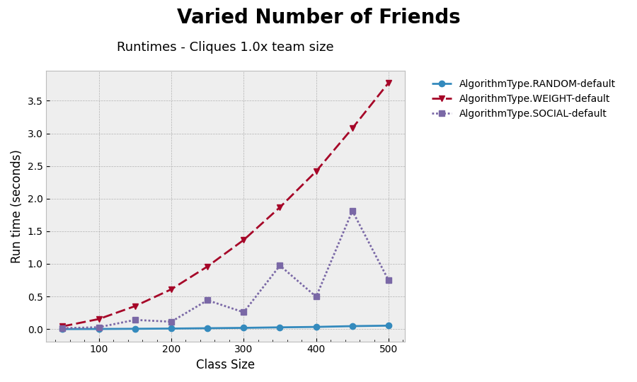

This graph is for the case when clique sizes are equal to the team size at a size of 4. At first, I thought this was a
problem with the graphing, but this behaviour actually has an explanation. When the class size isn't evenly divisible by
the team size, the social algorithm knows that a couple teams will need one extra student in order to fit all students
into the requested number of teams. This sets the `max_team_size` to 5 instead of 4, which triggers it to search for
cliques of size 5, even though there aren't any that big. This explains the extra time taken on class sizes not
divisible by 4. ***Note: This is considered a bug and is tracked by
issue [#269](https://github.com/Teamable-Analytics/algorithms/issues/269).***

For the rest of the clique sizes, we see more or less what we would expect.

Runtimes favor the case when cliques fit perfectly:

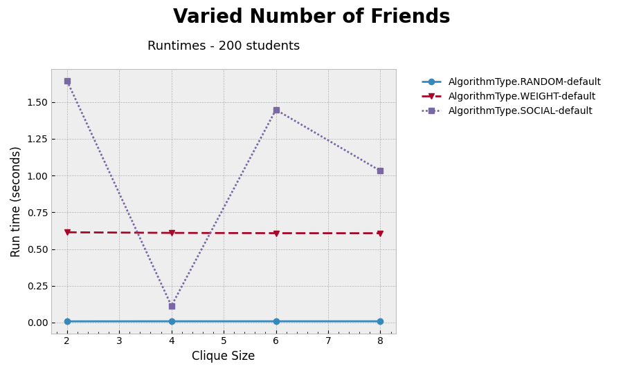

Students cannot be strictly happy when their clique is bigger than the team size:

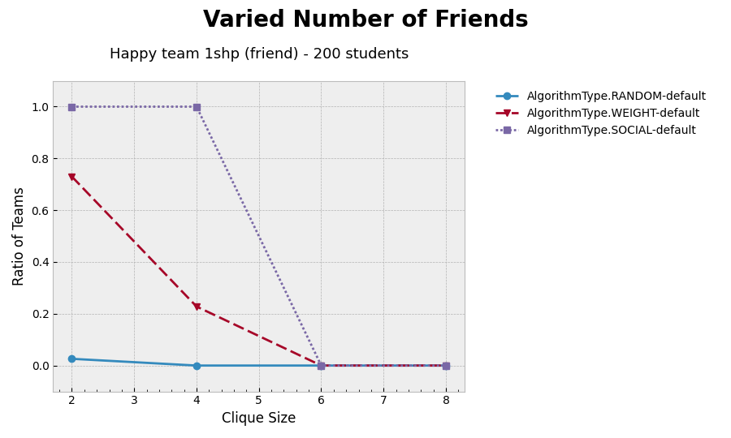

And enemy preferences are still satisfied:

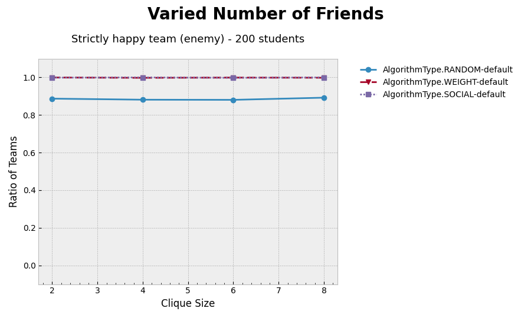

## Varying Number of Enemies

### Scenario

This run held everything constant except for the number of enemies each student had. The class size used was 250 and cliques and teams each had 5 students in them.

### Findings

This run did not expose anything significant other than reinforce the finding that enemy satisfaction is relatively easy problem to solve. The only algorithm to find it challenging was, unsurprisingly, the random algorithm, which had a roughly linear decay in the number of teams strictly happy in terms of enemies.

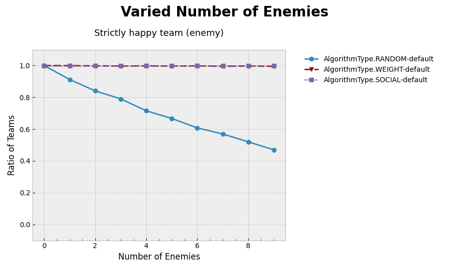

And runtime did not increase as the number of enemies increased:

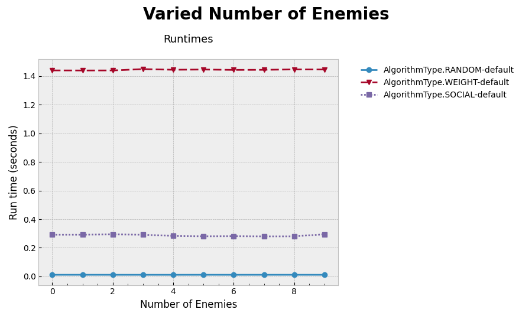

## Varying Team Size

The goal of this run was to study the effects of simultaneously increasing the team size and clique size to see if there were any abnormalities in the behaviour of the social algorithm as teams and cliques grow larger. This answers a different question than [varying the number of friends](#varying-number-of-friends) each student has because that was strongly influenced by the ratio of `clique_size/team_size`. 

### Scenario

Let clique sizes be equal to team size so that each clique should be able to fit into a team. For the same reason, I only used team sizes that evenly divide into the class size, which is 200.

### Findings

I was happy to find that the algorithm is still able to create perfect teams in this scenario, even as the team size got as large as 10.

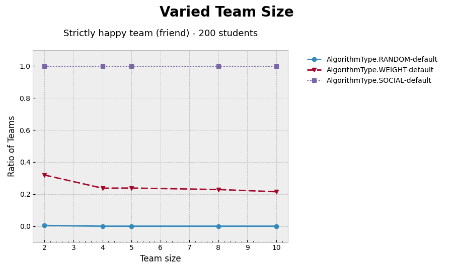

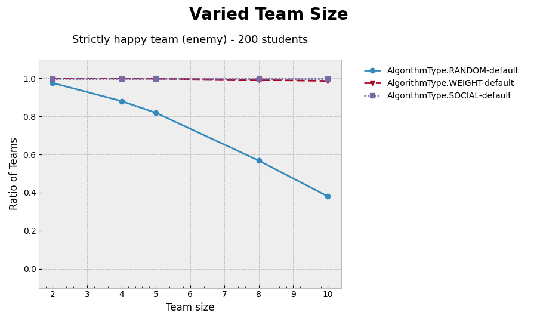

The most interesting characteristic displayed in this run is the runtimes. This is not surprising, though, given the non-linear runtime of finding cliques of size N, but it does show that we should be careful with allowing excessively large teams/cliques.

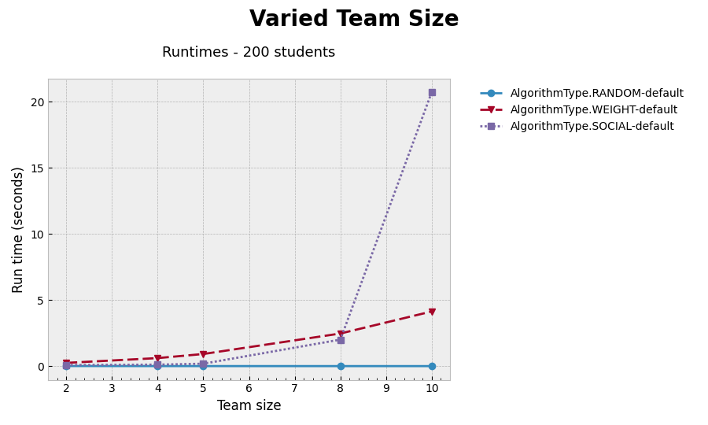

## Metrics

Each of these metrics can be applied to a student's friend or enemy preferences, but not both at the same time. Code
definitions are located in [student_calculations.py](../../evaluations/metrics/utils/student_calculations.py)
and [team_calculations.py](../../evaluations/metrics/utils/team_calculations.py).

- Happy person
    - At least one preference is met
- Strictly happy person
    - All preferences are met
- Strictly happy team
    - All members of the team are strictly happy

## Referenced Files

### Runs

- [varied_class_size.py](varied_class_size.py)
- [varied_num_enemies.py](varied_num_enemies.py)
- [varied_num_friends.py](varied_num_friends.py)
- [varied_team_size.py](varied_team_size.py)

### Graphs

- [varied_class_size](varied_class_size)
- [varied_num_enemies](varied_num_enemies)
- [varied_num_friends](varied_num_friends)
- [varied_team_size](varied_team_size)

